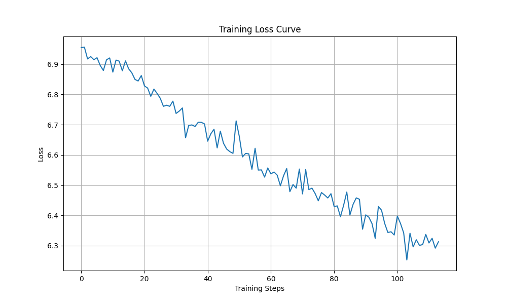

# CondenseNet

## 1. 模型概述

**CondenseNet** 是对 DenseNet 的改进，通过引入可学习分组卷积（Learned Group Convolutions），在训练过程中实现剪枝并优化网络结构，显著降低计算量和参数量。CondenseNet 实现了全密集连接和增长率的指数级增长，增强了特征表达能力，同时结合稀疏正则化和掩码机制，使剪枝更加精确且对精度影响较小。

> 本项目基于 [ShichenLiu/CondenseNet](https://github.com/ShichenLiu/CondenseNet)，参考 commit ID: [`833a91d`](https://github.com/ShichenLiu/CondenseNet/commit/833a91d5f859df25579f70a2439dfd62f7fefb29)

---

## 2. 快速开始
以下说明旨在帮助您快速搭建并运行 CondenseNet 模型进行训练。整体流程如下所示：
1. [基础环境安装](#21-基础环境安装)：介绍训练前需要完成的基础环境检查和安装。
2. [获取并准备数据集](#22-准备数据集)：介绍如何获取训练所需的数据集。
3. [构建运行环境](#23-构建环境)：介绍如何构建模型运行所需要的环境
4. [启动训练](#24-启动训练)：介绍如何运行训练。

### 2.1 基础环境安装
请参考[基础环境安装](../../../../doc/Environment.md)章节，完成训练前的基础环境检查和安装。  

### 2.2 准备数据集
#### 2.2.1 获取数据集
CondenseNet 官方使用 **ImageNet** 进行训练和评估。通常做法如下：
- 从 [ImageNet 官网](https://www.image-net.org/) 申请并下载原始数据集。
- 解压后应包含 `train` 和 `val` 两个文件夹。
- 数据集结构示例：

    ```text
    imagenet
    ├── train
    │   ├── class1
    │   ├── class2
    │   └── ...
    └── val
        ├── class1
        ├── class2
        └── ...
    ```

#### 2.2.2 处理数据集
- 确保将解压后的 ImageNet 数据集放置在 `/data/datasets/imagenet` 目录下
- 最终数据集路径示例：
   ```
   /data/datasets
   └── imagenet
       ├── train
       └── val
   ```

### 2.3 构建环境
所使用的环境下已经包含 PyTorch 框架虚拟环境。

1. **执行以下命令，启动虚拟环境**：
    ```bash
    conda activate torch_env
    ```

2. **安装 Python 依赖**  
   在启动虚拟环境后，执行以下命令安装项目所需的依赖：
   ```bash
   pip install -r requirements.txt
   ```


### 2.4 启动训练
1. **在构建好的环境中，进入训练脚本所在目录**：
    ```bash
    cd "<ModelZoo_path>/PyTorch/contrib/Classification/CondenseNet/scripts"
    ```

2. **开始训练**

   **方法一：使用 Shell 脚本启动（默认单机单卡，`epochs=1`）**
   ```bash
   bash train_sdaa_3rd.sh
   ```
   
   **方法二：使用 `torchrun` 命令启动**  
   单机单核组：
   ```bash
   torchrun --standalone --nnodes=1 --nproc_per_node=1 ../main.py /data/datasets/imagenet \
     --model condensenet \
     -j 20 \
     --stages 4-6-8-10-8 \
     --growth 8-16-32-64-128 \
     --batch-size 256 \
     --savedir /data/ckpt/condensenet_results \
     --print-freq 1
   ```
   单机单卡：
   ```bash
    torchrun --standalone --nnodes=1 --nproc_per_node=4 ../main.py /data/datasets/imagenet \
     --model condensenet \
     -j 20 \
     --stages 4-6-8-10-8 \
     --growth 8-16-32-64-128 \
     --batch-size 256 \
     --savedir /data/ckpt/condensenet_results \
     --print-freq 1
   ```


### 2.5 训练结果

#### 2.5.1 训练配置：
使用 `train_sdaa_3rd.sh` 训练了 114 步
#### 2.5.2 日志概览：  
   - 初始 loss 在 `7.0` 左右，随着迭代逐渐下降；  
   - 迭代到 114 步(共 1253 步)时，loss 降至约 `6.2` 附近；  
   - 单个迭代（iteration）耗时大约在 `388s` 左右（不同阶段略有波动），整个 epoch 预计 **120个小时** 完成。  

#### 2.5.3 最终指标(单 Epoch 结束后，供参考)： 
   - **最终训练 loss：** 约 `6.24~6.31` (根据收敛趋势推断，或略更低)  
   - **训练总时长：** 约 **12 小时**
   - 由于只进行了 **不到 1 个 Epoch** 的预训练，整体 loss  尚未达到完全收敛，只能作为一个简单的演示结果或快速验证；如需充分训练，请增加 Epoch 数到 120。 

示例训练的 loss 曲线如下（示例图）:


- **初始 loss**: 6.95 
- **最终 loss**: 6.31 
