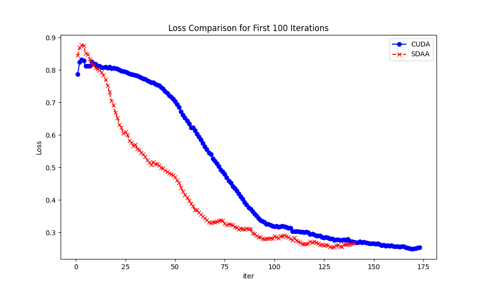

#  rpn

## 1. 模型概述
RPN（Region Proposal Network，区域建议网络）是目标检测领域中的一个关键模块，特别是在两阶段检测器如 Faster R-CNN 中被广泛应用。RPN 的主要任务是从输入图像中生成一组高质量的候选区域（proposals），这些候选区域可能包含目标对象，供后续的分类和边界框回归网络进一步处理。以下是关于 RPN 网络的详细介绍。

## 2. 快速开始
使用本模型执行训练的主要流程如下：
1. 基础环境安装：介绍训练前需要完成的基础环境检查和安装。
2. 获取数据集：介绍如何获取训练所需的数据集。
3. 构建Docker环境：介绍如何使用Dockerfile创建模型训练时所需的Docker环境。
4. 启动训练：介绍如何运行训练。

### 2.1 环境准备

#### 2.1.1 拉取代码仓

``` bash
git clone https://gitee.com/tecorigin/modelzoo.git
```

#### 2.1.2 Docker 环境准备

##### 获取 SDAA Pytorch 基础 Docker 环境

SDAA 提供了支持 Pytorch 的 Docker 镜像，请参考 [Teco文档中心的教程](http://docs.tecorigin.com/release/tecopytorch/v1.5.0/) -> 安装指南 -> Docker安装 中的内容进行 SDAA Pytorch 基础 Docker 镜像的部署。

##### 激活 Teco Pytorch 虚拟环境
使用如下命令激活并验证 torch_env 环境

``` bash
conda activate torch_env

# 执行以下命令验证环境是否正确，正确则会打印如下版本信息
python -c "import torch_sdaa"

--------------+----------------------------------------------
Host IP      | 127.0.0.1
PyTorch      | 2.0.0a0+gitdfe6533
Torch-SDAA   | 1.5.0
--------------+----------------------------------------------
SDAA Driver  | 1.1.1 (N/A)
SDAA Runtime | 1.1.0 (/opt/tecoai/lib64/libsdaart.so)
SDPTI        | 1.1.0 (/opt/tecoai/lib64/libsdpti.so)
TecoDNN      | 1.18.0 (/opt/tecoai/lib64/libtecodnn.so)
TecoBLAS     | 1.18.0 (/opt/tecoai/lib64/libtecoblas.so)
CustomDNN    | 1.18.0 (/opt/tecoai/lib64/libtecodnn_ext.so)
TecoRAND     | 1.5.0 (/opt/tecoai/lib64/libtecorand.so)
TCCL         | 1.15.0 (/opt/tecoai/lib64/libtccl.so)
--------------+----------------------------------------------
```

##### 2.1.3 安装依赖模块
使用如下命令安装依赖模块

``` bash
pip install openmim
mim install mmdet
pip install -r requirements.txt
cd mmengine
pip install -v -e .
cd mmcv-2.1.0
pip install -v -e .
```

### 2.2 数据集准备

使用脚本自动下载，解压数据集压缩包到指定位置，里面已经包括了训练集、验证集，无需再次划分：

``` bash
python tools/misc/download_dataset.py --dataset-name coco2017 --unzip --delete
```
```
目录结构如下

└── data
    ├──coco
    │   ├──train2017
    │   │   ├──图片1
    │   │   ├──图片2
    │   │   └── ...
    │   ├──val2017
    │   │   ├──图片1
    │   │   ├──图片2
    │   │   └── ...
    │   ├──annotations
    │   └── ...
```

    
### 2.3 启动训练

运行示例
下面给出了一个训练faster_rcnn模型的示例脚本，单卡三核组。

#### 2.3.1 在构建好的环境中，进入训练脚本所在目录。
    ```
    cd <ModelZoo_path>/PyTorch/contrib/Detection/mmdetection
    ```
   
#### 2.3.2 运行训练。该模型支持单机单卡。

##### 训练

- 单机单卡三SPA
   ```
   python run_scripts/run_mmdet.py --model_name rpn --nproc_per_node 3 --batch_size 4 --lr 1e-3 --epochs 10 --device sdaa --nnode 1 --node_rank 0 --data-dir data/coco
   ```
  
- 单机单卡单SPA
   ```
   python run_scripts/run_mmdet.py --model_name rpn --nproc_per_node 1 --batch_size 4 --lr 1e-3 --epochs 10 --device sdaa --nnode 1 --node_rank 0 --data-dir data/coco
   ```

  更多训练参数参考[README](run_scripts/README.md)

##### 测试

- 单机单卡三SPA
  ```
  python run_scripts/test_mmdet.py --model_name rpn --nproc_per_node 3 --rpn.pth --device sdaa --nnode 1 --node_rank 0 --data-dir data/coco
  ```

- 单机单卡单SPA
   ```
   python run_scripts/test_mmdet.py --model_name rpn --nproc_per_node 1 --rpn.pth --device sdaa --nnode 1 --node_rank 0 --data-dir data/coco
   ```

注：rpn.pth等官方权重可从https://mmdetection.readthedocs.io/en/latest/model_zoo.html中下载


在原始数据集上完成多次迭代(训练时间大于15分钟)的训练，打通了整个训练的pipeline，loss在CPU或者CUDA上对齐。


### Reference

https://github.com/open-mmlab/mmdetection

https://mmdetection.readthedocs.io/zh-cn/v2.28.0/index.html