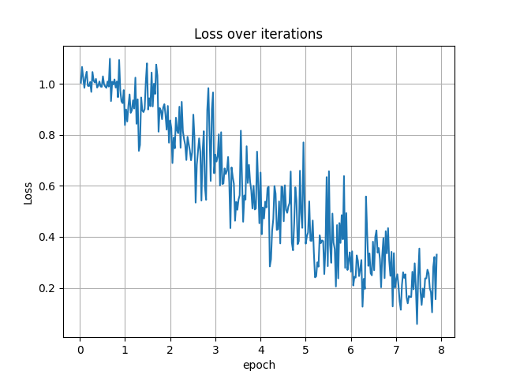

# BART

## 1.模型概述

BART模型是基于去噪自编码器的Transformer模型，用于Seq2Seq的任务。来自于[fairseq](https://github.com/facebookresearch/fairseq/tree/v0.10.2)，使用RTE数据对模型进行微调，训练环境为`fairseq`。

## 2.快速开始

### 2.1环境配置

请参考[基础环境安装](https://gitee.com/tecorigin/modelzoo/blob/main/doc/Environment.md)章节，完成训练前的基础环境检查和安装。

```bash
pip install -r requirements.txt
pip install -e .
```

### 2.2数据集获取与准备

数据集储存在`/data/datasets/20241122/RTE.zip`，将其解压至`./glue_data/RTE`，运行以下命令进行数据预处理。
```bash
./examples/roberta/preprocess_GLUE_tasks.sh glue_data RTE
```

### 2.3预训练模型准备

下载[bart_large](https://dl.fbaipublicfiles.com/fairseq/models/bart.large.tar.gz)以及[bart_base](https://dl.fbaipublicfiles.com/fairseq/models/bart.base.tar.gz)模型解压存放至`./examples/bart`。

注意下载下来的base模型的词表大小和代码中的不一致，这里直接将下载的模型参数截断处理了。运行`examples/bart/edit_ckpt.py`进行截断。

### 2.4模型训练

运行以下命令进行训练。
```bash
bash examples/bart/train.sh
```

### 2.5结果展示

训练loss曲线如下图所示。



可以看出随着训练的进行，loss整体呈现下降趋势。