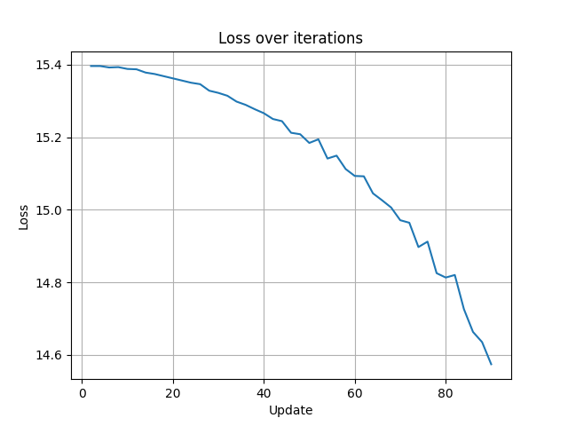

# Convolutional

## 1.模型概述

Convolutional模型使用卷积结构进行翻译任务。来自于[fairseq](https://github.com/facebookresearch/fairseq/tree/v0.10.2)，使用WMT14数据对模型进行训练，训练环境为`fairseq`。

## 2.快速开始

### 2.1环境配置

请参考[基础环境安装](https://gitee.com/tecorigin/modelzoo/blob/main/doc/Environment.md)章节，完成训练前的基础环境检查和安装。

```bash
pip install -r requirements.txt
pip install -e .
```

### 2.2数据集获取与准备

使用以下命令获取数据集并进行预处理。
```bash
# Download and prepare the data
cd examples/translation/
# WMT'17 data:
bash prepare-wmt14en2de.sh
# or to use WMT'14 data:
# bash prepare-wmt14en2de.sh --icml17
cd ../..

# Binarize the dataset
TEXT=examples/translation/wmt17_en_de
fairseq-preprocess \
    --source-lang en --target-lang de \
    --trainpref $TEXT/train --validpref $TEXT/valid --testpref $TEXT/test \
    --destdir data-bin/wmt17_en_de --thresholdtgt 0 --thresholdsrc 0 \
    --workers 20
```

### 2.3模型训练

运行以下命令进行训练。
```bash
bash examples/translation/train_conv.sh
```
训练时将glu回落到cpu上运行。

### 2.4结果展示

训练loss曲线如下图所示。



可以看出随着训练的进行，loss整体呈现下降趋势。