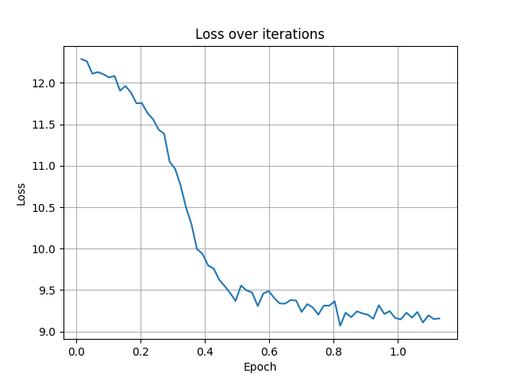

# GRU

## 1.模型概述

GRU是一种用于序列建模任务的循环神经网络（RNN），通过使用门控单元有效捕捉长距离依赖关系。整体模型来自于[fairseq](https://github.com/facebookresearch/fairseq/tree/v0.10.2)，其中的RNN部分则来自于fairseq的一个PR：[RNN](https://github.com/facebookresearch/fairseq/pull/3034)。使用IWSLT14数据进行训练，训练环境为`fairseq`。

## 2.快速开始

### 2.1环境配置

请参考[基础环境安装](https://gitee.com/tecorigin/modelzoo/blob/main/doc/Environment.md)章节，完成训练前的基础环境检查和安装。

```bash
pip install -r requirements.txt
pip install -e .
```

### 2.2数据集获取与准备

使用以下命令获取数据集并进行预处理。
```bash
# Download and prepare the data
cd examples/translation/
bash prepare-iwslt14.sh
cd ../..

# Preprocess/binarize the data
TEXT=examples/translation/iwslt14.tokenized.de-en
fairseq-preprocess --source-lang de --target-lang en \
    --trainpref $TEXT/train --validpref $TEXT/valid --testpref $TEXT/test \
    --destdir data-bin/iwslt14.tokenized.de-en \
    --workers 20
```
数据集储存在`data-bin`中。

### 2.3模型训练

使用以下命令训练模型
```bash
bash examples/gru_lstm/train_gru.sh
```

训练时将GRU部分回落到CPU运行。

### 2.4结果储存与展示

训练loss曲线如下图所示。



可以看出随着训练的进行，loss整体呈现下降趋势。