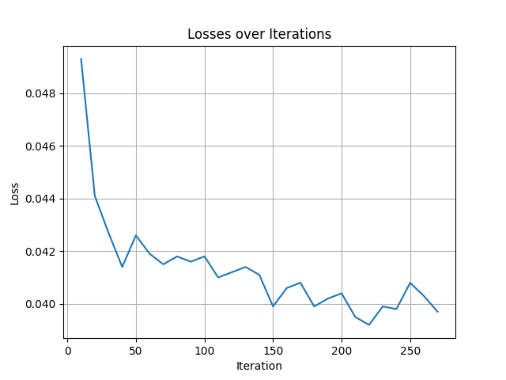

# BasicVSRpp

## 1.模型概述

BasicVSRpp基于视频超分辨率的先进模型，通过利用时空注意力机制提高了BasicVSR的性能，旨在进行高质量的帧插值和视频增强。来自于[mmagic](https://github.com/open-mmlab/mmagic)，使用REDS数据进行训练，训练环境为`mmagic`。

## 2.快速开始

### 2.1环境配置

请参考[基础环境安装](https://gitee.com/tecorigin/modelzoo/blob/main/doc/Environment.md)章节，完成训练前的基础环境检查和安装。

```bash
pip install -r requirements.txt
pip install -e .
```

需要安装mmengine以及mmcv。

### 2.2数据集获取与准备

数据集来自[REDS](https://seungjunnah.github.io/Datasets/reds.html)，放在`./data/REDS`中，运行以下命令进行数据的预处理。
```bash
python tools/dataset_converters/reds/preprocess_reds_dataset.py --root-path ./data/REDS
python tools/dataset_converters/reds/crop_sub_images.py --data-root ./data/REDS  -scales 4
```

### 2.3模型训练

运行以下命令进行训练。
```bash
bash configs/basicvsr_pp/train.sh
```

### 2.4结果展示

训练过程中的部分loss如下图所示。



可以看出随着训练的进行，loss呈现下降趋势。
