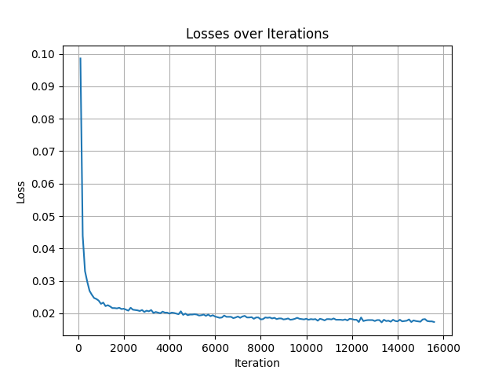

# ESRGAN

## 1.模型概述

LIIF是基于学习的图像插值框架，通过使用连续潜在表示来高效重建高质量图像，能够进行像素级的精准插值。来自于[mmagic](https://github.com/open-mmlab/mmagic)，使用DIV2K数据进行训练，训练环境为`mmagic`。

## 2.快速开始

### 2.1环境配置

请参考[基础环境安装](https://gitee.com/tecorigin/modelzoo/blob/main/doc/Environment.md)章节，完成训练前的基础环境检查和安装。

```bash
pip install -r requirements.txt
pip install -e .
```

需要安装mmengine以及mmcv。

### 2.2数据集获取与准备

数据集来自[DIV2K](https://data.vision.ee.ethz.ch/cvl/DIV2K/)，放在`./data/DIV2K`中。运行以下命令进行数据预处理。
```bash
python tools/dataset_converters/div2k/preprocess_div2k_dataset.py --data-root ./data/DIV2K
```

### 2.3模型训练

运行以下命令进行训练。
```bash
bash configs/liif/train.sh
```

### 2.4结果展示

训练过程中的loss曲线如下图所示。



可以看出随着训练的进行，loss曲线呈现下降趋势。